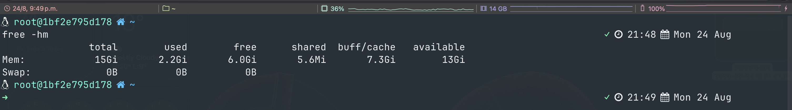
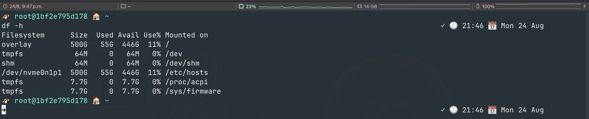

# A framework-free zsh setup

This is my zsh setup with no framework underneath it, just a few small files you can read top to bottom in a couple of minutes. It is plain zsh, so it runs the same on macOS and Linux, on whatever terminal you like. I was happily on Oh My Zsh with the Powerlevel9k theme some time back, so that is what I compare against here, but the same idea holds whatever you are moving off of. I just wanted to own the handful of files that run in my shell rather than lean on a whole framework for it.

## Index

- [Install](#install)
- [Prompt settings](#prompt-settings)
- [Why I moved off the framework](#why-i-moved-off-the-framework)
- [What replaces the theme](#what-replaces-the-theme)
- [The files](#the-files)
- [Keeping private things out of git](#keeping-private-things-out-of-git)
- [Rolling back](#rolling-back)

****

## Install

One line does it. It backs up whatever you already have into `~/.zsh/backups/`, grabs `.zshrc` and `.zsh/` from this repo without cloning the whole thing, and carefully leaves any `*.local.zsh` of yours untouched. Because it runs straight from the pipe, nothing ever gets written to disk.

```
curl -fsSL https://raw.githubusercontent.com/dsapab/wizardly-snippets/main/zsh-setup/install.sh | ZSH_PROMPT_ICONS=nerd-font sh
```

That default (`nerd-font`) also downloads and installs the small custom font the prompt uses. Want no font at all? Swap it for `ZSH_PROMPT_ICONS=plain` (or `emoji`). See [Prompt settings](#prompt-settings).

Then hop into the new shell.

```
exec zsh
```

And fair enough, piping someone's script into `sh` is exactly the kind of thing this repo is wary of. If you would rather look before you leap, please do. Save it somewhere, read through it, and run it once you are happy.

```
curl -fsSL https://raw.githubusercontent.com/dsapab/wizardly-snippets/main/zsh-setup/install.sh -o /tmp/zsh-install.sh
less /tmp/zsh-install.sh
sh /tmp/zsh-install.sh && rm /tmp/zsh-install.sh
```

A couple of things to have ready: zsh 5.x, and (for the default `nerd-font` style) your terminal set to the bundled `JetBrainsMono FA` font once the installer adds it. Would rather not install a font? Pick `plain` or `emoji` and there is nothing extra to do. If you do not have the Homebrew `zsh-syntax-highlighting` or `zsh-autosuggestions` packages, just delete those two `source` lines from `.zshrc` and everything else runs happily without them.

## Prompt settings

Your preferences live in `~/.zsh/config.zsh`. The installer creates that file only if it is missing, so anything you set there survives every future update. The rest of the config gets overwritten when you update; this one file does not. Two settings for now.

- `ZSH_PROMPT_ICONS` chooses the icon style, one of `nerd-font` (default), `plain`, or `emoji`.
  - `nerd-font` uses a small custom font I built (JetBrains Mono with a few icons merged in). In this mode the installer downloads and installs the font file for you. Installing the file is only half of it. You then have to tell your terminal to use it, and where that setting lives depends on which terminal you run. On macOS I use and recommend [iTerm2](https://github.com/gnachman/iterm2), where it is under Settings, Profiles, Text, Font, then choose `JetBrainsMono FA`. Any terminal works, the option just sits in a different place. See [fonts/](./fonts).
  - `plain` uses only symbols present in any preinstalled macOS or Linux font, so there is nothing to install.
  - `emoji` uses your system emoji, also nothing to install (colorful, and a touch wider).
- `ZSH_PROMPT_SHOW_HOST` set to `true` shows the hostname after your username (`user@host`). Default `false`.

Edit a value and run `exec zsh`. To choose the style up front, set it on the install command, e.g. `ZSH_PROMPT_ICONS=plain`.

### How the styles look

`nerd-font`, the default, using the bundled font:



`emoji`, which needs no font at all:



## Why I moved off the framework

None of this is really a knock on Oh My Zsh. It is a good project, Powerlevel10k too, and they do plenty out of the box. What put me off was the attack surface.

It updates itself with a scheduled `git pull`, so code I never read lands on my laptop and runs the next time I open a terminal. It also ships something like 300 plugins and 150 themes, all runnable, and I used maybe five. If any of that upstream went bad one day, it would run as me. Every plugin framework works this way, so I do not really hold it against Oh My Zsh. I just wanted something smaller that I could keep an eye on.

Speed was the other one, and the one I felt every day. The old startup read every library file, checked for updates, and loaded seven plugins before it handed me a prompt. This one runs `compinit`, draws the prompt, and gets out of the way.

I did lose a few things. The plugin manager is gone, and so are one-command updates. The themes gallery too, though I never really browsed it. I only touch my shell a few times a year, so that was an easy trade for knowing exactly what runs when I open a terminal.

## What replaces the theme

That colored branch name and the little dirty-state marker looked like Powerlevel9k doing the work, but Powerlevel9k was never the thing reading git. It leans on `vcs_info`, which has shipped inside zsh for years. So `prompt.zsh` just calls `vcs_info` itself and paints the branch along with the staged and unstaged markers. No theme, no plugin needed.

The two things that are not built in are the command coloring and those grey autosuggestions, and even they are only two Homebrew packages loaded at the bottom of `.zshrc`. Still no framework in sight.

## The files

A handful of small files, none of them long.

- `.zshrc` is the glue. It sets PATH, loads your `config.zsh`, sources the files below, then picks up anything named `~/.zsh/*.local.zsh`.
- `core.zsh` is the unglamorous but important stuff: completion and how it is styled, history, the `ls` and directory aliases, and arrow-key history search.
- `prompt.zsh` builds the prompt and wires git in through `vcs_info`, and it also times how long your last command took.
- `aliases.zsh` is the git, file, and shell shortcuts. I checked every name against real commands first, so none of them will shadow something you actually meant to run.
- `security.zsh` is home for anything hardening-related. For now that is a single line, the Log4Shell mitigation for JVM tools.
- `config.example.zsh` is the template for your `~/.zsh/config.zsh` (icon style, hostname). The installer copies it into place only if you do not already have one, so your settings are never overwritten.

## Keeping private things out of git

The `.zshrc` loads every `~/.zsh/*.local.zsh` file it can find, and if there are none it just carries on. That is where anything private or machine-specific goes, safely away from the committed files. Want work-only paths and aliases? Drop in a `work.local.zsh`. Something meant for one laptop? `laptop.local.zsh`. The `.gitignore` in here already ignores `*.local.zsh`, so you would have to try pretty hard to commit one by accident.

## Rolling back

No hard feelings if it turns out not to be your thing. The installer tucks whatever it replaced into `~/.zsh/backups/<timestamp>/`, and it even prints the exact restore command as it finishes. To undo the last run:

```
d=$(ls -td ~/.zsh/backups/*/ | head -1)
cp "$d/.zshrc" ~/.zshrc && cp "$d"/*.zsh ~/.zsh/ && exec zsh
```
